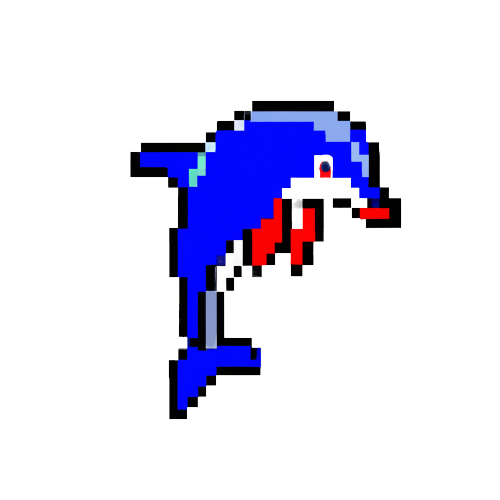

# Validolphin



**Validolphin** is a lightweight npm package that provides a zero-dependency system for avoiding tedious data validation.
Usable both in **FRONTEND** and in **BACKEND**

## Installation

You can install Validolphin using npm. Run the following command:
```
npm install validolphin
```
Alternatively, you can import Validolphin using this HTML tag
```html
<script type="application/javascript" src="https://cdn.jsdelivr.net/gh//leonardocrociani/Validolphin/Validolphin-Frontend.js"></script>
```

## Usage
Import the package main class
```javascript
const Validolphin = require('validolphin');
```
Create a configuration variable
```javascript
const config = {
  unexpectedKeyError : <String>,      /* A CUSTOM ERROR WHEN AN OBECT TO VALIDATE HAS A KEY THAT IS NOT EXPECTED */
  missingKeyError : <String>,         /* A CUSTOM ERROR WHEN AN OBECT TO VALIDATE HAS A KEY THAT IS MISSING */
  errorsAtTime : <Number>,            /* THE NUMBER OF ERRORS TO DISPLAY IN THE RETURNED OBJECT, DEFAULT = 3 */
  validables : [                      /* AN ARRAY OF VALUES THAT DEFINES THE VALIDABLES OBJECTS */
    ...
    {
      name : <String>                 /* THE NAME OF THE FUNCTION TO CALL IF YOU WANT TO VALIDATE THE ASSOCIATED OBJECT */,
      schema : {                      /* THE VALIDATION SCHEMA OF THE OBJECT */
        field : {
          type: <Number | String | Array | Boolean | [Validolphin.types]>, 
          minVal : <Number>,            /* SET ONLY IF type == Number */  
          maxVal : <Number>,            /* SET ONLY IF type == Number */ 
          minLen : <Number>,            /* SET ONLY IF type == String */ 
          maxLen : <Number>,            /* SET ONLY IF type == String */ 
          elCount: <Number>,            /* SET ONLY IF type == Array */ 
          minEl  : <Number>,            /* SET ONLY IF type == Array */
          maxEl  : <Number>,            /* SET ONLY IF type == Array */
          homogen: <Boolean>,           /* SET ONLY IF type == Array */ 
          checkRule: <Function>,        /* A function to check al the element in the array. SET ONLY IF type == Array */
          matchDomain : <String>,       /* SET ONLY IF type == Validolphin.types.Email */
          notAllowedArr : <Array>,      /* The array of not allowed domains (check the example below) SET ONLY IF type == Validolphin.types.Email */
          nullable: <Boolean>           /* DEFAULT : false */
          err: <String>                 /* CUSTOM ERROR */ 
        },
        ...
    }
    ...
  ]
}
```
NOTE: here's a list of all Validolphin types. Every type use a regex for validation. All the regex are available in ```Validolphin.utils.* ```
```javascript
Validolphin.types.Email;
Validolphin.types.Password;
Validolphin.types.Domain;
Validolphin.types.Phone;
Validolphin.types.Iban;
Validolphin.types.CreditCard;
```
Create the validation object
```javascript
const validator = new Validolphin(config);
```
Now, you can call the functions with 
```javascript
validator.<name_of_the_validable_object>( object_to_validate )
```

## Example
Here's an example of how to use Validolphin in your JavaScript code:

```javascript
const Validolphin = require('validolphin');

// Create an instance of Validolphin by passing a configuration object
const config = {
  validables: [
    {
      name: 'user',
      schema: {
        username: { type: String, minLen: 4, maxLen: 20 },                           // LEGAL IF value is a string and has length >= 4 and <= 20
        email: { type: Validolphin.types.Email, notAllowedArr: ['legit.com'] },      // LEGAL IF value is an email and has domain != 'legit.com'. E.g. 'leonardo@legit.com' -> NON LEGAL
        parentEmail : { type: Validolphin.types.Email, matchDomain : 'noxes.it' },   // LEGAL IF value is an email and has domain == 'noxes.it'. E.g. 'info@xeons.it' -> NON LEGAL 
        age: { type: Number, minVal: 18, maxVal: 100 },                              // LEGAL IF value is a number and is >= 18 and <= 100
        medals : { type: Array, nullable: true, homogen: true, checkRule: function (el) { return ['GOLD', 'SILVER', 'BRONZE'].includes(el) } }                      // IF defined (nullable:true) the value is LEGAL IF has type Array and has all the element of the same type
      }
    }
  ]
};

const validator = new Validolphin(config);

// Validate an object using the defined validation function
const user = {
  username: 'john',
  email: 'john@example.com',
  age: 25
};

const validationResult = validator.user(user);

if (validationResult.valid) {
  console.log('Validation successful!');
} else {
  console.error('Validation failed:', validationResult.error);
}

```

## License
This project is licensed under the Creative Commons Attribution 4.0 International License (CC-BY-4.0).

## Issues
If you encounter any issues or have any suggestions, please feel free to open an issue on the GitHub repository.

Enjoy using Validolphin for your data validation needs!
